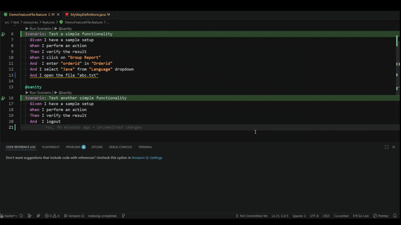
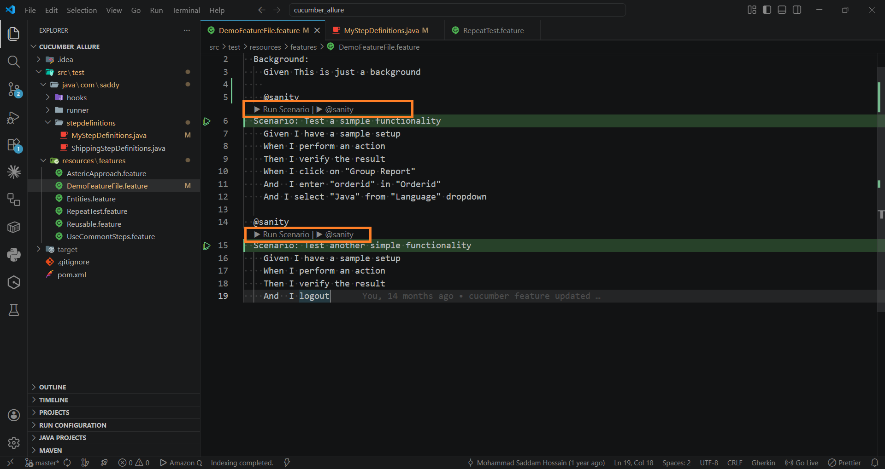
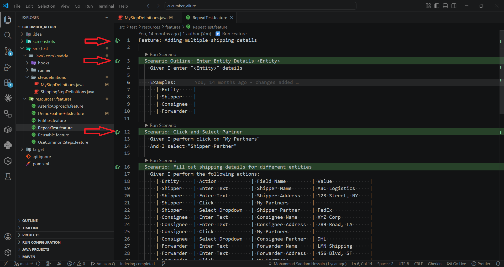
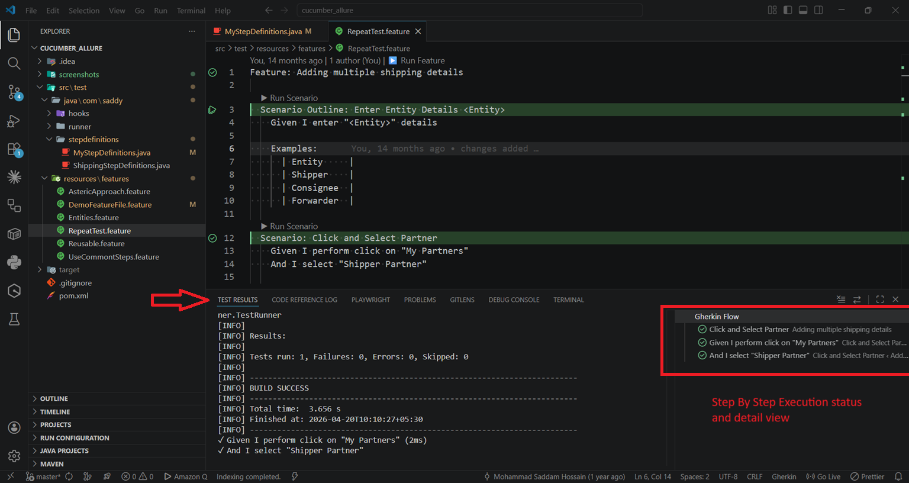
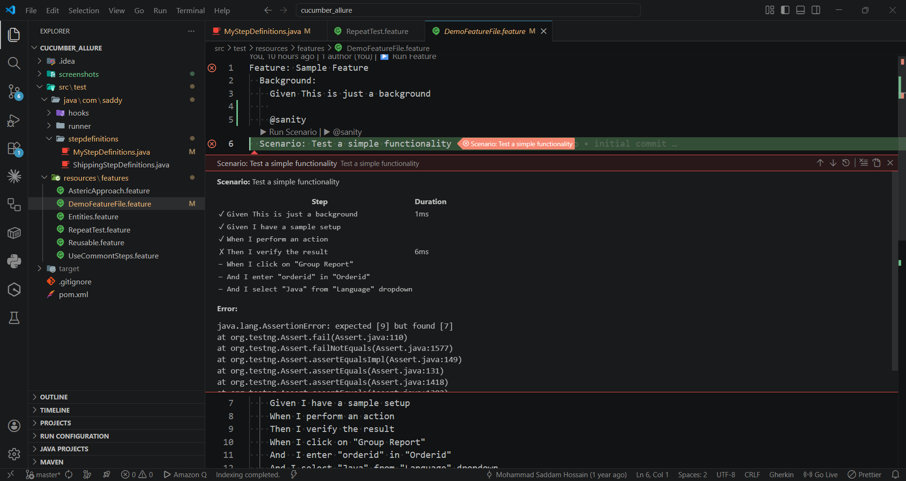
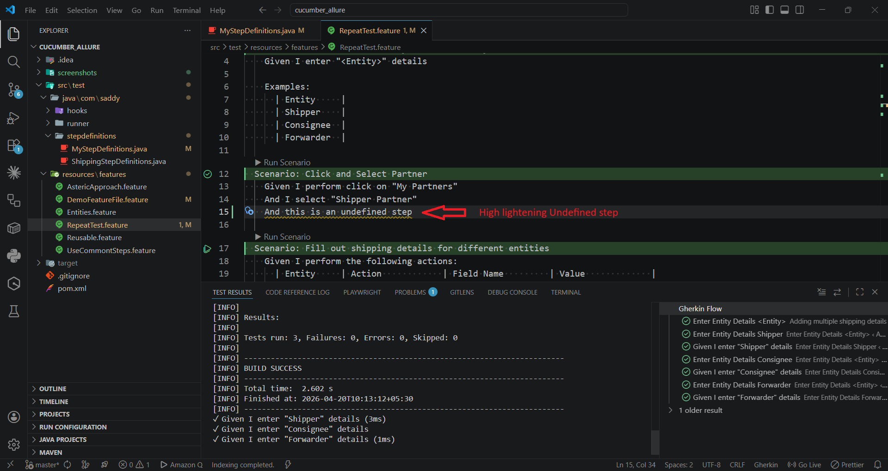

# Gherkin Flow

**Debug Gherkin tests 5× faster — without leaving VS Code.**

> Built for **QA Automation Engineers** and **BDD teams** who write Cucumber scenarios daily and want their editor to actively support their workflow — not just display files.

---



---

## The Problem

Your Gherkin test fails. Now what?

1. Scroll through 300 lines of Maven output to find which step broke
2. Copy the error, manually search across Java files
3. Open the file, fix the step, switch back to the terminal
4. Re-run the entire suite and wait again
5. Repeat — ten times a day

That's not a test workflow. That's a context-switch tax.

**GherkinFlow eliminates every one of those switches.** Run, inspect, navigate, and fix — all from the feature file.

---

## Screenshots

<table>
  <tr>
    <td align="center" width="50%">
      
      <br/><sub><b>▶ One-Click Run</b><br/>Run buttons appear inline above every scenario — no terminal needed</sub>
    </td>
    <td align="center" width="50%">
      
      <br/><sub><b>▶ Run Feature File</b><br/>Run all scenarios including Scenario Outline examples</sub>
    </td>
  </tr>
  <tr>
    <td align="center" width="50%">
      
      <br/><sub><b>🧪 Step-by-Step Results</b><br/>See exactly which step passed or failed — with timing</sub>
    </td>
    <td align="center" width="50%">
      
      <br/><sub><b>🔴 Failure Right in Your File</b><br/>Error message shown as inline ghost text on the failed step</sub>
    </td>
  </tr>
  <tr>
    <td align="center" colspan="2">
      
      <br/><sub><b>⚠️ Missing Step Detection</b><br/>Undefined steps underlined before you even run — with autocomplete</sub>
    </td>
  </tr>
</table>


---

## Why GherkinFlow?

| Without GherkinFlow | With GherkinFlow |
|---|---|
| Run tests from the terminal | Click **▶** directly above any scenario |
| Scroll terminal output to find failures | See pass/fail **per step** in Test Explorer |
| Search Java files manually for step definitions | **Ctrl+click** any step to jump instantly |
| No editor feedback while writing steps | **Autocomplete** from your existing definitions |
| Undefined steps only fail at runtime | **Underline warning** appears as you type |
| Write stub boilerplate by hand | **Generate all missing stubs** in one click |
| No context when reading a step | **Hover** shows the matched pattern + doc comment |

---

## Features

### ▶ One-Click Run — No Terminal Needed
Clickable **▶ Run Scenario** and **▶️ Run Feature** buttons appear inline above every scenario. Tag buttons appear automatically for tagged scenarios — run `@smoke` or `@regression` directly from the file.

```
@smoke @regression
▶ Run Scenario  ▶ @smoke  ▶ @regression
Scenario: Admin login
```

You can also right-click anywhere in a feature file:
- **Run Scenario (GherkinFlow)** — runs the scenario at your cursor
- **Run Feature File (GherkinFlow)** — runs all scenarios in the file

### 🧪 Know Exactly Which Step Failed
The VS Code Testing panel shows a full hierarchical tree with pass ✓ / fail ✗ per step and execution time. Click any failed step to see the full error message, stack trace, and `System.out.println` / log output captured during that step.

```
▼ Feature: Login
  ▼ ✗ Scenario: Admin login         (320ms)
      ✓ Given I am on the login page
      ✓ When I enter admin credentials
      ✗ Then I see the dashboard     ← AssertionError: expected 'Login' but was 'Dashboard'
  ▼ Scenario Outline: Login as <role>
    ▼ ✓ Login as admin
        ✓ Given I log in as "admin"
```

### 🔴 See the Error Without Leaving the File
After a run, failed steps are highlighted with a red background and the error message is shown as inline ghost text — right on the line that broke. No switching windows, no scrolling logs.

```
  ✓ Given I am on the login page
  ✓ When I enter admin credentials
  ✗ Then I see the dashboard   ← AssertionError: expected 'Login' but was 'Dashboard'
```

Decorations clear automatically on the next run.

### 💬 Hover to Inspect Any Step
Hover any Gherkin step to see the matched Cucumber expression, the source file and line number, and the Javadoc/JSDoc comment if one exists above the method.

```
@Given("I enter {string} in {string}")
LoginSteps.java:42

---
Enters text into a named input field.
@param value  the text to type
@param field  the field label
```

### 🔗 Ctrl+Click to Jump to the Definition
**Ctrl+click** any step to jump directly to the matching Java, TypeScript, or JavaScript step definition. Supports both Cucumber Expressions (`{string}`, `{int}`) and regex patterns. Updates automatically when your step files change.

### 💡 Autocomplete from Your Own Codebase
Type `Given `, `When `, `Then ` and get inline suggestions pulled from your existing step definitions — with snippet placeholders for parameters.

```
Given I enter |
              ↓
  ✦ I enter {string} in {string}
  ✦ I enter {int} items
```

### ⚠️ Catch Missing Steps Before Running
Steps with no matching definition are underlined with a warning as you write them — not after a failed run. Hover the underline to see the message. All unmatched steps also appear in the **Problems** panel (Ctrl+Shift+M).

### ⚡ Generate All Missing Stubs in One Click
A `⚡ Generate Missing Steps (N)` button appears on the Feature line when unmatched steps exist. Click it to generate all stubs at once — pick an existing step file or create a new one. A light bulb quick fix on each underlined step also offers single or bulk generation.

Generated stubs include correct annotations, parameter types (including `DataTable` and `DocString`), and file headers for Java, TypeScript, and JavaScript:

```java
@Given("I enter {string} in {string}")
public void iEnterInField(String arg0, String arg1) {
    // TODO: implement
    throw new io.cucumber.java.PendingException();
}
```

### 🔧 Zero-Config Build Detection
Automatically detects your build tool — no configuration file needed:

| Tool | Detected by |
|---|---|
| `./gradlew` / `gradlew.bat` | wrapper in project root |
| `mvn` / `./mvnw` | `pom.xml` or wrapper in project root |
| `npx cucumber-js` | `@cucumber/cucumber` in `package.json` |

---

## Quick Start

1. Open any workspace containing `.feature` files — the extension activates automatically
2. Click **▶ Run Scenario** above any scenario
3. Watch results appear step-by-step in the **Testing** panel (flask icon in the Activity Bar)
4. Click a failed step to read the error and stack trace
5. **Ctrl+click** any step to jump to its implementation

---

## Requirements

### Java (Maven / Gradle)
- Cucumber JVM 7+
- Maven or Gradle as the build tool
- A Cucumber JSON reporter writing to `target/cucumber-report.json`

Add the JSON reporter to your runner if not already present:
```java
@CucumberOptions(
    plugin = { "json:target/cucumber-report.json" }
)
```

### JavaScript / TypeScript
- `@cucumber/cucumber` in `package.json`
- The extension auto-detects and runs via `npx cucumber-js`
- JSON output written to `reports/cucumber.json` (configured automatically if no `cucumber.js` config file is found)

---

## Roadmap

These are planned or under consideration. Contributions and feature requests welcome via [GitHub Issues](https://github.com/shossain786/gherkin-flow/issues).

- [ ] **Run up to selected step** — execute a scenario and stop at the step you choose
- [ ] **Tags sidebar panel** — browse and filter all scenarios by tag across the workspace
- [ ] **Scenario history** — track pass/fail trends per scenario across multiple runs
- [ ] **Allure report integration** — read Allure JSON alongside the Cucumber JSON report
- [ ] **Parallel run support** — merge results from parallel Cucumber executions

---

## Release Notes

### 0.9.8
Fix: clicking a run button while a test is already running now cancels the active run before starting the new one — no more two processes running simultaneously. A **$(stop-circle) Stop GherkinFlow** button appears in the status bar during any run and cancels it immediately when clicked.

### 0.9.7
- **Format Document** (`Shift+Alt+F`) fixes Gherkin indentation in one shot — Feature at 0, Scenario/Background at 2, steps at 4, Examples table rows at 6; works with Format on Save
- **Run single Examples row** — each data row in a Scenario Outline Examples table gets its own `▶ Run | col1 | col2 |` CodeLens so you can test one row without commenting out the others
- **Duplicate scenario name warning** — flags both occurrences inline and in the Problems panel when two scenarios in the same feature file share a name
- **Shell injection fix** — scenario and tag names are now passed as separate args to `spawn` with `shell: false` instead of interpolated into a shell command string
- **Async step file reads** — `_reloadFile` now uses `vscode.workspace.fs.readFile` instead of blocking `fs.readFileSync`

### 0.9.6
Quality improvements: autocomplete now matches mid-string (type any word in a step and suggestions appear); diagnostics re-evaluation after step file changes is debounced to 300 ms to avoid redundant passes during rapid edits; diagnostics provider now reacts to the step index's own change event instead of maintaining a separate `FileSystemWatcher`.

### 0.9.5
Internal quality fixes: map leaks on feature file reload, `CancellationTokenSource` disposed after each run, `GherkinFlow` terminal reused across tag runs, warning shown when Cucumber JSON report is missing after a run, decoration types properly disposed on deactivation, dead code removed.

### 0.9.4
Fix: Ctrl+click on a step again opens the step definition in a new permanent tab. The DocumentLinkProvider is restored for navigation; a `textDecoration: none` decoration is applied over matched step text to cancel the underline VS Code would otherwise show.

### 0.9.3
- Fix: step text in feature file is no longer underlined (removed DocumentLinkProvider; Ctrl+click via DefinitionProvider is unaffected)
- Fix: steps in Test Explorer now appear in the same order as the feature file — `sortText` set on all test items using their file position index
- Fix: `🔄 Re-run` button now appears on the specific scenario that failed, not at the top of the feature file

### 0.9.2
- Ctrl+click on a step now opens the step definition in a **new permanent tab** instead of reusing the current editor
- Hover tooltip now correctly renders Javadoc/JSDoc HTML tags (`<br>`, `<ul>`, `<li>`, `<b>`, etc.)
- `🔄 Re-run Failed (N)` CodeLens appears on the Feature line after any run that had failures — re-runs only the failed scenarios

### 0.9.1
README overhaul — new headline, pain-to-solution hook, Why GherkinFlow comparison table, benefit-driven feature descriptions, roadmap section, and demo GIF.

### 0.9.0
Step hover tooltip — hovering any Gherkin step shows the matched Cucumber pattern, the step definition file and line number, and the Javadoc/JSDoc comment if one is present above the method.

### 0.8.2
Fix: the light bulb quick fix now correctly includes `DataTable`/`DocString` parameters — previously only the CodeLens path detected them; the quick fix path rebuilt the step without checking the following lines.

### 0.8.1
Fix: generated step definitions now include the correct extra parameter when a step is followed by a DataTable (`io.cucumber.datatable.DataTable` for Java, `DataTable` for TypeScript) or a DocString (`String` / `string`).

### 0.8.0
Generate Step Definitions — `⚡ Generate Missing Steps (N)` CodeLens appears on the Feature line when unmatched steps exist. Click to generate all stubs at once into a chosen step definition file. A light bulb quick fix on each underlined step offers single-step or bulk generation. Supports Java, TypeScript, and JavaScript with correct annotations, types, and file headers.

### 0.7.4
Fix: clicking a step in Test Explorer now shows `System.out.println` and log output captured during that step — parsed from the `output` field in the Cucumber JSON report.

### 0.7.3
Fix: scenario names containing double quotes (`"`) no longer break the run command — quotes are replaced with `.` (regex wildcard) in the Cucumber filter, which matches correctly without shell quoting issues.

### 0.7.2
Fix: scenario run command now includes feature file path (`-Dcucumber.features`) so projects with Maven runner class configuration work correctly.

### 0.7.1
Added Marketplace screenshots showcasing all key features.

### 0.7.0
JavaScript/TypeScript Cucumber support — auto-detects `@cucumber/cucumber` projects, runs via `npx cucumber-js`, scans `.ts`/`.js` step definitions for jump, autocomplete, and missing step detection.

### 0.6.0
Gherkin syntax highlighting — proper TextMate grammar with coloured keywords, tags, strings, table cells, docstrings, and outline parameters.

### 0.5.0
Inline failure decoration — failed steps highlighted with red background and inline error text.

### 0.4.0
Gherkin autocomplete — step definition suggestions while typing in `.feature` files.

### 0.3.0
Missing step detection — warning underlines for steps with no matching Java definition.

### 0.2.0
Step Definition Jump (Ctrl+click), Tag Filtering CodeLens buttons, GitHub Actions CI/CD.

### 0.1.0
Initial release with CodeLens, Test Explorer integration, Scenario Outline support, and step-level results.
